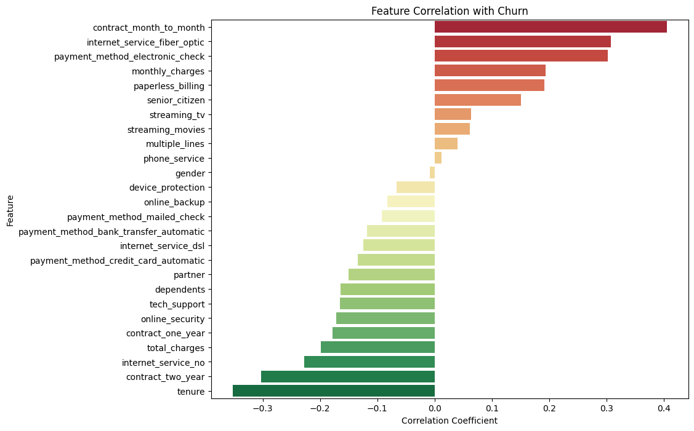
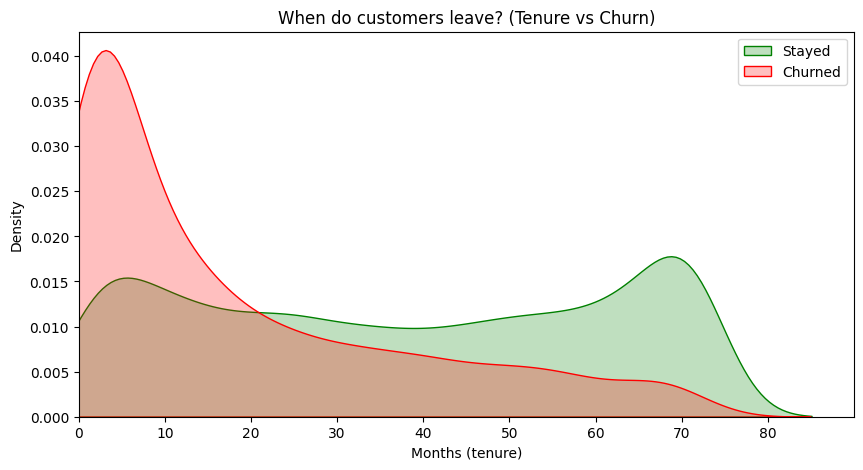
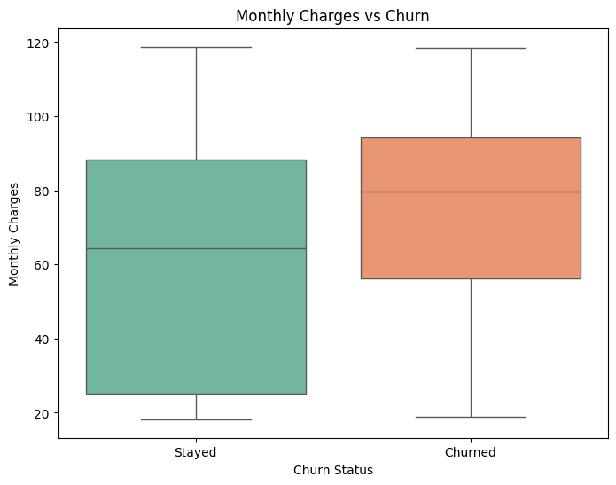
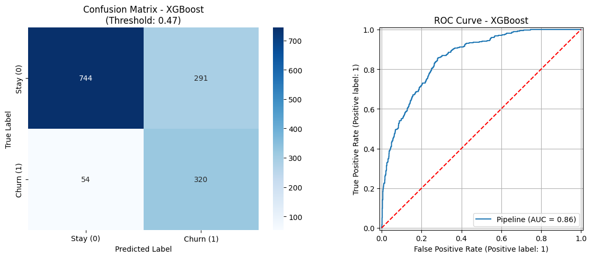

# Customer Churn Prediction

This project focuses on predicting customer attrition in the telecommunications industry. The goal is to identify at-risk customers and understand the key drivers of churn using both traditional Machine Learning and Deep Learning approaches.

## ⚙️ Project structure

### 1. Data Preprocessing
In this stage, the raw data was cleaned and transformed to be suitable for modeling. Key actions included:
* **Standardizing column names** to a consistent format.
* **Feature Encoding:** Converting binary categorical variables to 0/1 and applying **One-Hot Encoding** (via `pd.get_dummies`) for multi-state categorical features.

> **Note:** A detailed step-by-step analysis of this stage can be found in [01-preprocessing.ipynb](01-preprocessing.ipynb).

### 2. Comparative Analysis of Binary Classifiers
This stage involved a comprehensive evaluation of classic machine learning algorithms and a targeted analysis of customer data:
* **Feature Analysis:** Visualizations were created to identify key churn drivers, including:
    * Feature correlation with the target variable (Churn).

        

    * Density plots of **Customer Tenure** vs. Churn.

         

    * The relationship between **Monthly Charges** and customer attrition.

         

* **Model Evaluation:** A wide range of algorithms was tested, including KNN, Logistic Regression, Random Forest, Naive Bayes, Decision Tree (DTC), XGBoost, and AdaBoost.
* **Threshold Optimization:** Instead of relying on the default 0.5 threshold, **decision threshold tuning** was applied to maximize the **F1-score**, ensuring an optimal balance between Precision and Recall.

> **Note:** A detailed step-by-step analysis of this stage can be found in [02-churn_prediction_model_comparison.ipynb](02-churn_prediction_model_comparison.ipynb).

### 3. Deep Learning Approach
The final stage utilized neural networks to capture complex patterns in the dataset:
* **MLP Classifier:** Implemented as a baseline neural network model.
* **Custom Neural Networks (Keras/TensorFlow):** Two distinct architectures were developed:
    * **F1-optimized Network:** Focused on balancing churn detection with prediction reliability.
    * **Accuracy-optimized Network:** Designed to maximize the overall percentage of correct predictions for both classes.

> **Note:** A detailed step-by-step analysis of this stage can be found in [03-churn_prediction_neural_networks.ipynb](03-churn_prediction_neural_networks.ipynb).

## 📝 Results

### Final model selection and performance

After a comprehensive evaluation of all tested algorithms, XGBoost was selected as the optimal model for this project. Although models like KNN achieved a higher F1-Score, XGBoost significantly outperformed all others in Recall (0.86), which was defined as the primary success metric for this business case.

The following table presents a summary of the best-performing configurations for each model:

| Model | Best Threshold | Accuracy | Recall | F1-Score |
| :--- | :---: | :---: | :---: | :---: |
| **KNN** | 0.4127 | **0.80** | 0.75 | **0.6620** |
| **MLP Classifier** | 0.2200 | 0.78 | 0.81 | 0.6580 |
| **AdaBoost** | 0.4545 | 0.79 | 0.77 | 0.6576 |
| **Random Forest** | 0.5047 | 0.78 | 0.78 | 0.6547 |
| **Logistic Regression** | 0.5482 | 0.78 | 0.79 | 0.6534 |
| **Custom Neural Network** | 0.3121 | 0.77 | 0.80 | 0.6500 |
| **XGBoost** | 0.4717 | 0.76 | **0.86** | 0.6497 |
| **Decision Tree** | 0.5938 | 0.77 | 0.77 | 0.6393 |
| **Naive Bayes** | 0.8378 | 0.78 | 0.74 | 0.6391 |

### Detailed classification results (XGBoost)

The detailed metrics for the optimized XGBoost model demonstrate its effectiveness in identifying at-risk customers:

| Class | Precision | Recall | F1-Score | Support |
| :--- | :---: | :---: | :---: | :---: |
| **0 (Stay)** | 0.92 | 0.73 | 0.81 | 1035 |
| **1 (Churn)** | **0.52** | **0.86** | **0.65** | **374** |
| | | | | |
| **Accuracy** | | | **0.76** | 1409 |
| **Macro Avg** | 0.73 | 0.79 | 0.73 | 1409 |
| **Weighted Avg** | 0.82 | 0.76 | 0.77 | 1409 |

 

In the telecommunications industry, a high Recall for Class 1 is the most critical factor, as it is far more valuable to identify a potential churner than to maintain a high accuracy for staying customers. With a Recall of 0.86, this XGBoost configuration successfully captures 86% of all actual churn cases. While this comes at the cost of some precision (0.52), the model maintains a solid F1-score (0.65) and a reliable overall accuracy (76%), providing the best actionable insights for retention strategies.

## 🛠️ Technologies Used

